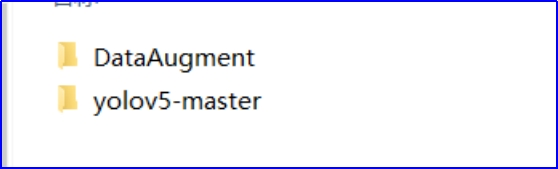
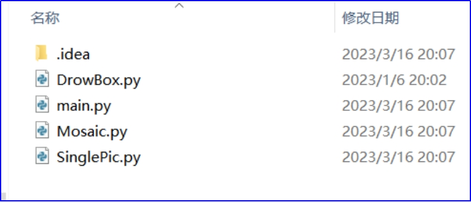
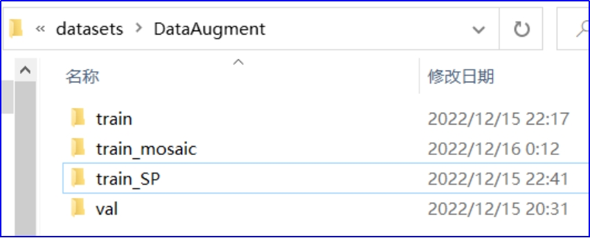
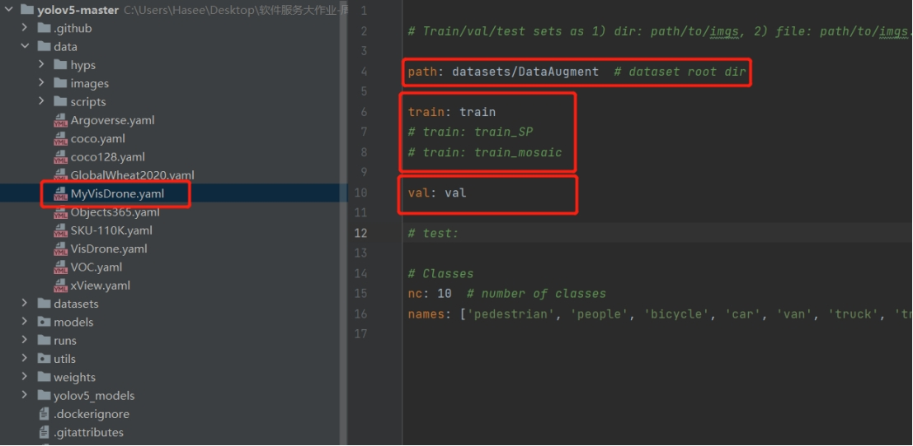
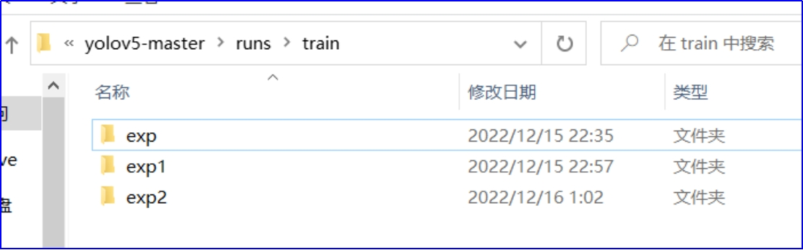

# 基于公开数据集增强样本量实现车辆目标检测

主要任务：样本合成，基于公开数据和原始数据，进行合成数据生成，扩充样本库，验证是否可以通过使目标尺度尽可能多样化，以提高模型泛化性能

常用数据增强技术：

随机翻转（左右、上下）

随机色调(H)、饱和度(S)、明度(V)调整

随机旋转，缩放，平移、错切、透视等

mixup，cutout, cutmix, mosaic等

复制增强，自适应采样

### 1. **实验环境**

操作系统：Windows10

实验配置：python3.7 + pytorch1.10 + cuda11.3

数据集：VisDrone2019

模型：Yolov5

### 2. **文件结构**

实验代码主要包括以下两个部分

 

（1）样本合成：即数据增强DataAugment，根据已有的数据集生成更多的图片，扩充样本库。

（2）yolov5训练：即用yolov5模型对数据集（包括生成的新图片）进行训练，查看是否可以提高模型性能。

### 3. **实验过程**

###### **3.1实验准备——转换数据集标签**

实验开始前，先将VisDrone数据集的annotations标签转换为yolov5所需要的labels，

（即 ***\*类别 + x_center + y_center + w + h\****的格式），该文件路径为：

Assignment\yolov5-master\visdrone2yolov5.py

 

###### **3.2样本合成（即DataAugment文件夹代码）**

文件目录如下：

 

SinglePic.py：单图片样本合成，如翻转，HSV增强、旋转、平移、缩放、剪切、透视、

Mosaic.py：Mosaic样本合成

***\*注：以上三种样本合成方式在生成新图片的同时，也会根据相应的几何变换生成新的labels。\****

DrowBox.py：根据新生成的labels标注出新图片中的标注物

main.py：主函数，综合调用以上各个函数，分别为以上三种样本合成提供图片输入与输出的路径。

输入与输出的图片路径为：\yolov5-master\datasets\DataAugment\

###### **3.3 Yolov5训练（即yolov5-master文件夹代码）**

***\*（1）训练所需的数据集\****

位于路径\yolov5-master\datasets\

 

train文件夹：未作改变的原图，共150张

train_SP文件夹：通过SinglePic.py处理过后的图片，共900张

train_mosaic文件夹：通过Mosaic.py处理过后的图片，共150张

val文件夹：30张图片，用于测试训练结果

 

***\*（2）构造数据集配置文件\****

从VisDrone.yaml修改而得：MyVisDrone.yaml

 

***\*注：train路径共有三个，对应上一步中三个文件夹，每次训练时需要更改train的路径。\****

 

***\*（3）开始训练\****

在终端运行：

1. python train.py 
2. --data data/MyVisDrone.yaml 
3. --cfg models/yolov5s.yaml 
4. --weights weights/yolov5s.pt 
5. --workers 4 
6. --batch-size 8
7. --epochs 50

***\*注：为了训练不同方式所生成的图片，\*******\*每次训练时需要更改MyVisDrone.yaml文件中train的路径。\*******\*同时通过控制每次训练的批次epochs，来保证每次训练所使用的图片数相等。\****

***\*一共训练3次。\****

 

***\*（4）结果分析\****

 

训练结果位于：\yolov5-master\runs\train\路径下，通过比较结果中“car”类别精确度可以发现，样本合成能够显著提高模型的精确度。